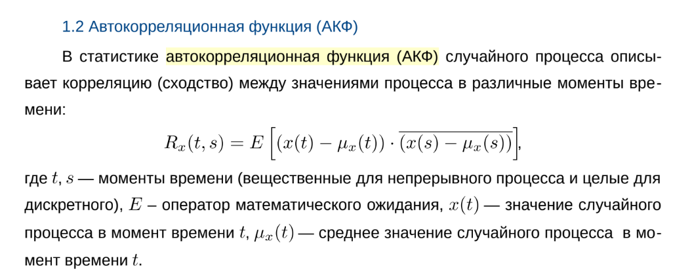
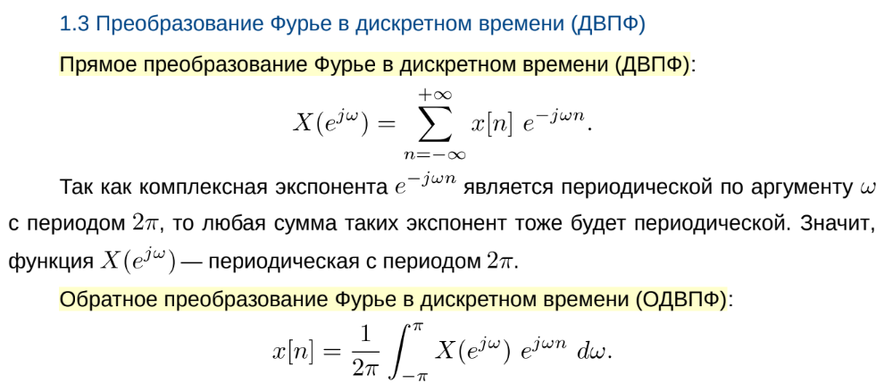
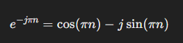
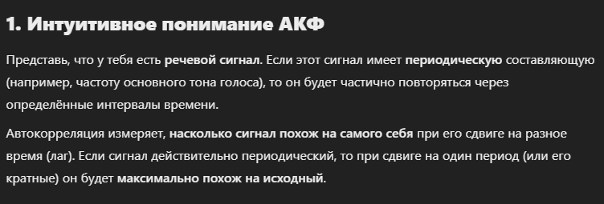
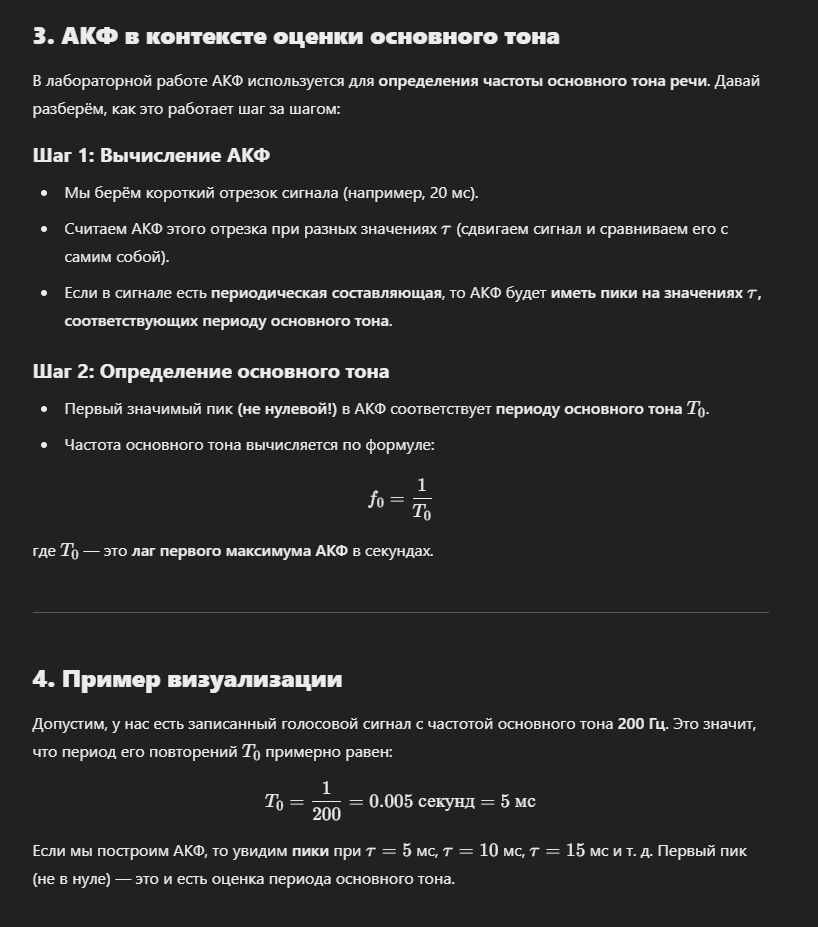
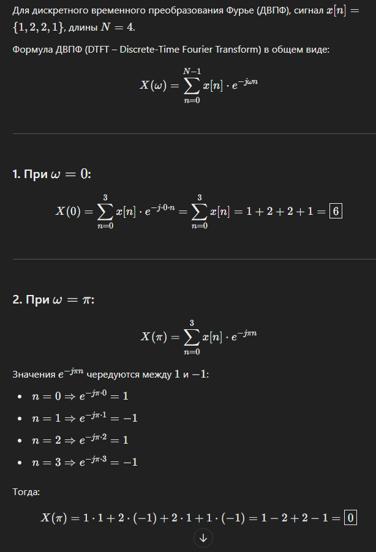

# 1. Определение АКФ и ДВПФ.
**ответ:**

# 2. Чему равно значение ДВПФ для сигнала {1,2,2,1} при ω = 0 и при ω = pi? Вычислите эти значения вручную.

# 3. Задачка
**С учётом периодичности ДВПФ есть смысл вычислять значения только для какого-то одного периода, например при ω ∈ (-pi; pi] рад/отсчет. Если сигнал является вещественным, то спектр будет обладать чётной симметрией — информативным останется только полупериод ω ∈ [0; pi]. Для какой максимальной частоты (в герцах) есть смысл вычислять ДВПФ, если fs = 44100Гц? Другими словами, начиная с какой частоты значения спектра перестанут быть информативными и начнут повторяться?**

# 4. С помощью функции из прошлой лабораторной создайте чистый тон с некоторой частотой и длительностью 1 с. Постройте график спектра такого сигнала с помощью my_dtft с достаточно мелким шагом в области частоты. Почему на построенном графике виден не строгий чёткий пик при соответствующий частоте тона, а некоторая его размытая версия?

