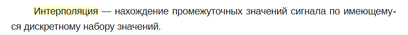
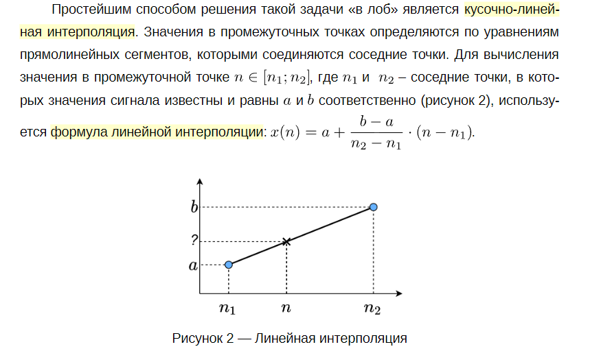
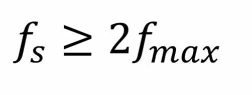
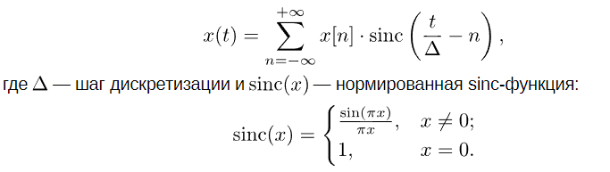
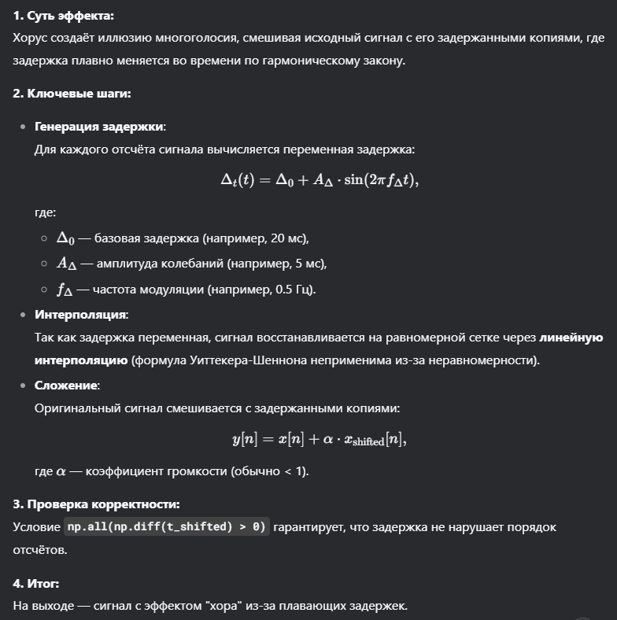
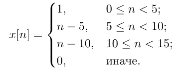
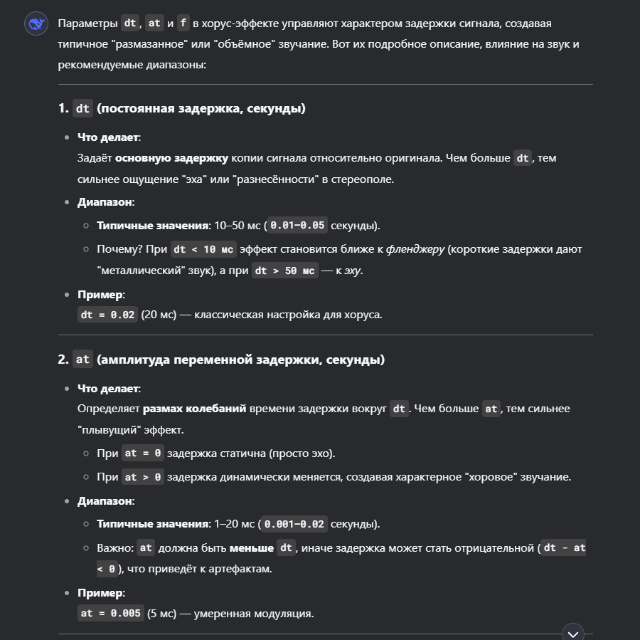
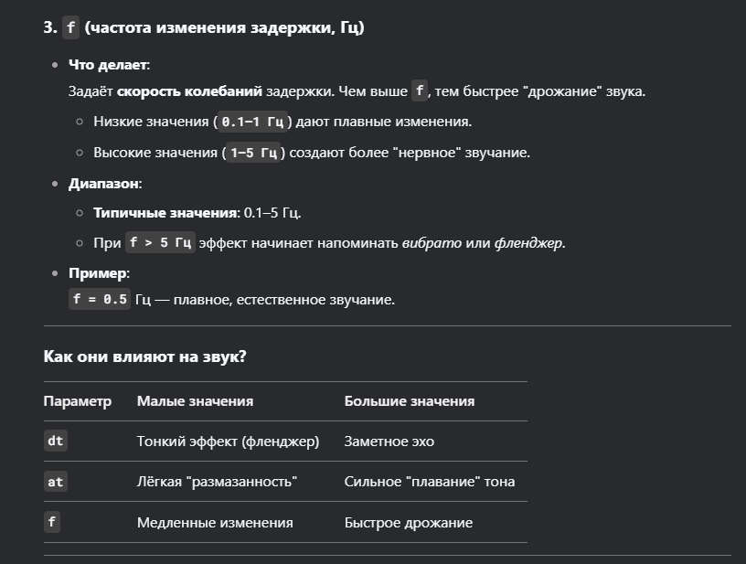

# 1. Линейная интерполяция.

# 2. Теорема Котельникова.

# 3. Интерполяционная формула Уиттекера-Шеннона.

# 4. Алгоритм хорус-эффекта 

# 5. Дан сигнал x[n] = u[n]- u[n-4], где u[m] - единичный скачок  . В предположении, что дискретизация проводилась при выполнении условий теоремы Котельникова, напишите код, который рисует восстановленный непрерывный сигнал. Так как на компьютере доступна отрисовка только дискретных сигналов, допустить упрощение, что непрерывный сигнал — это дискретный сигнал с очень мелким шагом.
[Ответ см. тут](q.ipynb)

# 6. Для приведённого ниже дискретного сигнала восстановите различные непрерывные версии — используя  **numpy.interp** и интерполяционную формулу Уиттекера-Шеннона:

[Ответ см. тут](q.ipynb)

# На всякий:
## dt at f

